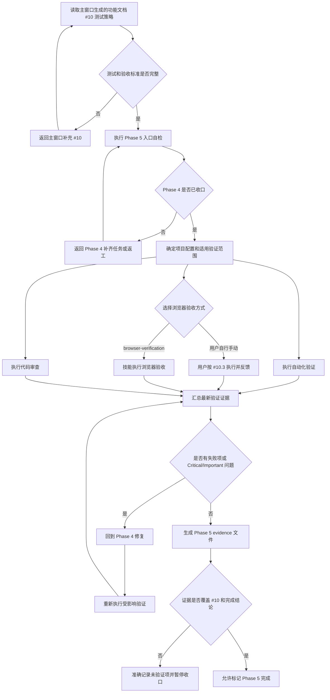

# Phase 5：测试验收

用于根据已确认的功能技术文档执行验证、收集证据、处理返工并决定是否允许收口。

## 1. 职责边界

- 本文件负责验收流程、验证范围、证据记录和收口规则。
- 具体业务验收标准由主窗口生成并确认的功能技术文档提供。
- `verification-before-completion` 负责通用验收标准和最终完成声明门禁，本文件只补充 Phase 5 的执行规则。

## 2. 验收输入

执行 Phase 5 前，只读取主窗口已经生成并确认的功能技术文档 `# 10 测试策略`。

- `# 10` 是本次自动化验证和手动验收的唯一测试输入。
- 不重复读取功能文档的其他章节；其内容已在主窗口生成 `# 10` 时完成整理。
- 若 `# 10` 缺少测试范围、用例、入口、环境或结果记录方式，返回主窗口补充后再开始验收。
- 不得在 Phase 5 临时猜测、扩展或改变 `# 10` 中未确认的验证范围。

## 3. 验收流程



## 4. Phase 5 入口自检

进入测试验收前必须确认 Phase 4 已收口，任一不满足则回到 Phase 4 补齐：

- `spec/` 下所有计划或子任务规格均已有对应执行产物。
- 使用 MCP 编排时，`tasks.json` 中不存在 `pending`、`running`、`failed` 或 `rework_requested` 任务。
- 使用 MCP 编排时，所有已完成任务都已由主 Agent 审查，通过项应标记为 `reviewed`。
- 如存在 `reworks/`，当前返工必须已完成并覆盖原 `resultFile`。
- `results/` 中的执行报告能对应到每个 `spec/*.md`。
- Phase 4 没有遗留的新增范围、接口契约或验收标准变更。

## 5. 执行验证

### 5.1 自动化验证

根据项目 `package.json`、本次改动范围和功能技术文档 `# 10` 确定需要执行的自动化验证命令。

- 使用项目实际包管理器和已有 scripts，不混用包管理器。
- 没有固定脚本时，才使用框架通用命令。
- 仅执行与项目配置和改动范围相关的检查，不固定要求测试、类型检查、lint 或构建全部执行。
- 命令执行、输出核对、验证范围判断和结果表述遵循 `verification-before-completion` 技能。
- 将实际命令、选择理由、结果和证据写入本阶段的 evidence 文件。

常见命令仅作示例，必须按项目实际调整：

```bash
<pm> test src/pages/page-name/ -- --coverage
<pm> typecheck
<pm> exec tsc --noEmit
<pm> lint
<pm> build
```

### 5.2 浏览器验收方式

浏览器验收有两种方式，开始前根据环境和用户意愿选择一种，并在 evidence 文件中记录验收方式。环境可被 AI 访问时优先使用方式 B；需要业务人员确认或 AI 无法访问环境时使用方式 A。

#### 方式 A：用户自行手动验收

用户按照功能技术文档 `# 10.3 手动验收测试` 执行验收，并反馈：

- 通过或不通过。
- 问题截图和复现步骤。
- 设备、浏览器和屏幕尺寸。
- 未验证项和阻塞原因。

主窗口将用户反馈整理到 Phase 5 evidence 文件。用户无法访问环境或无法提供有效证据时，不能直接记录为通过。

#### 方式 B：由 AI 使用 `browser-verification` 技能验收

由 AI 在浏览器中执行页面操作、视觉检查、网络检查、控制台检查和 DOM 检查；用户负责提供必要的访问权限和环境信息。推荐由独立验收子窗口执行，主窗口应：

1. 将 `# 10.3 手动验收测试` 的入口、验收项和环境要求挂载到验收任务，并依据 `# 10.1`、`# 10.2` 确认自动化验证范围。
2. 等待验收任务完成，读取其 `resultFile`，只提取环境、截图、通过项、失败项和阻塞原因。
3. 如有失败项，提取失败证据作为返工原因，在 Phase 4 生成自包含返工文档。
4. 修复完成并覆盖原 `resultFile` 后，重新执行受影响验收。

验收子窗口不得修改业务代码、启动或停止服务，也不得宣布 Phase 5 完成。结果文件建议为：

```text
docs/design/YYYY-MM-DD-<topic>-design/results/05-browser-verification-result.md
```

视觉任务优先复用验收子窗口生成的 `assets/screenshots/` 和验收结论；主窗口只在现有证据不足时读取关键截图，不重新获取或完整分析原始设计资源。

### 5.3 代码审查

- 按 `requesting-code-review` 技能执行代码审查，不把代理报告、VCS diff 或已有测试结果单独当作审查通过证据。
- Critical / Important 问题必须修复，并重新执行受影响验证和 Delta Review。
- Minor 问题记录处理状态，不得将未处理的 Minor 误报为“无问题”。

## 6. 证据记录

只在 Phase 5 生成：

```text
docs/design/YYYY-MM-DD-<topic>-design/evidence/phase5-verification.md
```

Phase 4 只生成 `tasks.json`、`results/` 和按需 `reworks/`。证据文件必须记录 `# 10` 中适用测试和验收内容的实际结果，不得只写“页面正常”。

```md
# Phase 5 验证证据

## 验收依据

- 来源：功能技术文档 `# 10 测试策略`
- 验收范围：...

## 自动化验证

| 命令 | 选择理由 | 结果 | 退出码 | 验证范围 | 关键输出 |
|------|----------|------|--------|----------|----------|
| `...` | `# 10.1` / `# 10.2` 中的测试要求 | 通过 / 失败 / 未执行 / 不适用 | ... | ... | ... |

## 手动验收

| 验收项 | 结果 | 操作或观察证据 | 截图 / 复现步骤 |
|--------|------|----------------|----------------|
| `# 10.3` 中的手动验收项 | 通过 / 失败 / 未验证 / 不适用 | ... | ... |

- 入口：...
- 环境：...
- 验收方式：用户自行手动 / `browser-verification` 技能
- 未验证项：...
- 阻塞原因：...

## 代码审查

- 审查方式：...
- Critical：...
- Important：...
- Minor：...
- 处理结果：...

## 收口结论

- 结论范围：...
- 证据是否覆盖 `# 10` 和完成结论：是 / 否
- 最终状态：通过 / 阻塞 / 部分完成
```

## 7. 返工与收口

- 验收失败：回到 Phase 4 修复，再重新执行受影响的 Phase 5 验证。
- Critical / Important 审查问题：修复后重新验收和审查。
- 只验证了部分范围时，只报告已验证部分，不得宣称整体完成。
- Phase 5 的完成声明必须遵循 `verification-before-completion` 的验收标准和验证门控；本阶段证据不足时不得标记完成。
