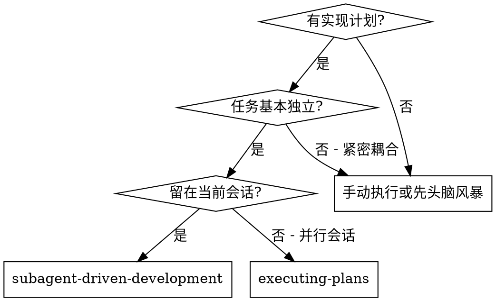
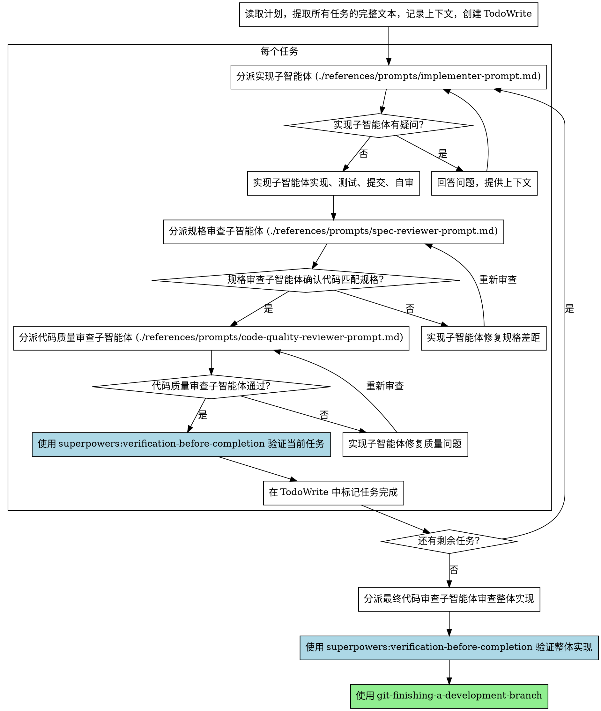

# 子智能体驱动开发

通过为每个任务分派一个全新的子智能体来执行计划，每个任务完成后进行两阶段审查：先审查规格合规性，再审查代码质量。

**为什么用子智能体：** 你将任务委派给具有隔离上下文的专用智能体。通过精心设计它们的指令和上下文，确保它们专注并成功完成任务。它们不应继承你的会话上下文或历史记录——你要精确构造它们所需的一切。这样也能为你自己保留用于协调工作的上下文。

**核心原则：** 每个任务一个全新子智能体 + 两阶段审查（先规格后质量）= 高质量、快速迭代

**执行形态红线：** 如果实际工作是由当前主会话直接读取文件、分析代码、编辑文件和运行验证，而不是把任务分派给一个全新的隔离子智能体，那么这不属于本技能。此时不得宣告“正在使用 subagent-driven-development”，应改用更贴近实际执行形态的技能或默认工作流。

## 独立子代理的含义

选择本技能时，`独立子代理` 不是泛指“开一个辅助模型”，而是有以下硬约束：

1. 它**不继承你当前会话的上下文历史**。主会话里之前看过什么、讨论过什么、试过什么，子代理默认都不知道；你必须把当前任务所需的计划文本、上下文、约束和目标重新明确提供给它。
2. 它**只处理被分派的那一小块任务**。如果计划里有多个任务，当前子代理只能处理自己拿到的任务文本，不能顺手扩展其他任务，也不能假设自己知道整个项目讨论历史。
3. 它**是一次性的、隔离的**。任务 A 和任务 B 应使用不同的新子代理，避免错误假设、临时判断和无关细节在任务之间传播。
4. 它**由主控制者调度，不是自己乱跑**。主控制者负责决定给它什么上下文、何时停止、何时重派、何时进入审查；子代理不应自行扩大范围或私自沿用主会话里未显式提供的旧方案。

### 不是本技能的情况

以下情况都**不算**在使用 `subagent-driven-development`：

1. 主会话自己直接读取业务文件，然后自己做实现、补丁和验证。
2. 只是口头上说“使用子代理驱动开发”，但实际没有调用新的隔离子代理。
3. 所谓“子代理”实际上继承了主会话里的讨论历史、文件判断或现成结论，而不是只拿到显式分派的任务上下文。
4. 因为任务很小、改动很简单，就跳过真实的分派与审查流程，仍然把它归类为本技能。

一旦出现这些情况，控制者必须停止把当前流程表述为本技能，并切换到更符合实际的流程，例如 `executing-plans`、其他实施类 skill，或默认的直接实现流程。

## 何时使用

默认不建立隔离工作区，直接在当前工作区内分派隔离子代理并推进计划。

**按需进入：** 如果用户明确要求隔离工作区，或当前任务确实需要把实现工作切到独立 worktree 中，才进入 `git-worktrees`。否则不要把它当作默认前置步骤。

**与 Executing Plans（并行会话）的对比：**
- 同一会话（无上下文切换）
- 每个任务全新子智能体（无上下文污染）
- 每个任务后两阶段审查：先规格合规性，再代码质量
- 更快的迭代（任务间无需人工介入）

## 流程

## 参考模块

以下内容已拆到 `references/` 下的子目录中，避免主文件超过 300 行，并保持 `references/` 目录本身只放文件夹：

- `references/guides/operator-guide.md`：模型选择、实现者状态处理、提示词模板
- `references/examples/examples-and-rationale.md`：完整示例工作流、优势与成本说明

进入本技能后，按需读取：

1. 需要判断给实现者、规格审查者、代码质量审查者分配什么模型时，读取 `references/guides/operator-guide.md`
2. 需要根据实现者返回状态决定下一步，或需要查看提示词模板时，读取 `references/guides/operator-guide.md`
3. 需要完整演练一遍工作流、向用户解释为什么选这个技能，或查看优缺点时，读取 `references/examples/examples-and-rationale.md`

## 红线

**绝不：**
- 未经用户明确同意就在 main/master 分支上开始实现
- 在当前流程已经明确选择隔离工作区后，跳过 `git-worktrees` 就直接开始实现
- 跳过 `superpowers:verification-before-completion` 就标记任务完成、进入下一个任务或宣称整体完成
- 在没有真实分派隔离子代理的情况下，宣告自己正在使用 `subagent-driven-development`
- 把主会话直接实现的结果描述成“子代理完成的任务”
- 把主会话里“刚才讨论过的方案”“同类页面的做法”“之前试过的判断”当成子代理已知前提，除非这些内容已被重新写进当前分派上下文
- 跳过审查（规格合规性或代码质量）
- 带着未修复的问题继续
- 并行分派多个实现子智能体（会冲突）
- 让子智能体读取计划文件（应提供完整文本）
- 跳过场景铺设上下文（子智能体需要理解任务在哪个环节）
- 忽视子智能体的问题（在让它们继续之前先回答）
- 在规格合规性上接受"差不多就行"（规格审查者发现问题 = 未完成）
- 跳过审查循环（审查者发现问题 = 实现者修复 = 再次审查）
- 让实现者的自审替代正式审查（两者都需要）
- **在规格合规性审查通过之前开始代码质量审查**（顺序错误）
- 在任一审查有未解决问题时就进入下一个任务

**如果子智能体提问：**
- 清晰完整地回答
- 必要时提供额外上下文
- 不要催促它们进入实现阶段

**如果审查者发现问题：**
- 实现者（同一子智能体）修复
- 审查者再次审查
- 重复直到通过
- 不要跳过重新审查

**如果子智能体失败：**
- 分派修复子智能体并提供具体指令
- 不要尝试手动修复（上下文污染）

## 技能集成

选择本技能后，不要只读取本文件就开始执行。下面这些集成技能不是“背景参考”，而是分阶段生效的硬依赖。

### 前置技能

#### 用户指令覆盖

如果用户明确要求不要创建 worktree，例如为了继续复用当前浏览器会话、直接观察当前工作区里的页面变化，控制者应服从该要求。由于本技能现在默认就留在当前工作区，这类要求只需要被记录和遵守，不需要再把它当作对默认流程的例外。

如果用户明确要求建立隔离工作区，或你判断当前任务必须切到独立 worktree，再进入 `git-worktrees`。此时：

1. 要明确告诉用户：当前将切到隔离工作区执行，这是对默认流程的增强，而不是默认行为
2. 完成 worktree 建立后再开始实现
3. 其余关于计划、子代理分派、审查和验证的要求仍然有效

#### 进入本技能后的必做顺序

1. **开始实现前：** 默认留在当前工作区；只有在用户明确要求隔离工作区，或当前任务确实需要切到独立 worktree 时，才读取 `git-worktrees`。
2. **开始分派任务前：** 确认当前存在可执行计划；如果计划尚未产出或不够具体，先回到 `superpowers:writing-plans`。
3. **分派实现子智能体时：** 在分派说明里明确要求实现子智能体遵循 `superpowers:test-driven-development`。
4. **进入正式审查前：** 先读取 `superpowers:requesting-code-review`，按其审查模板和节奏组织审查上下文。
5. **标记任务完成或进入下一个任务前：** 先读取并执行 `superpowers:verification-before-completion`，确认当前任务已有新鲜验证证据。
6. **所有任务完成后：** 先读取并执行 `superpowers:verification-before-completion`，确认整体实现通过验证。
7. **准备收尾前：** 先读取 `git-finishing-development-branch`，再进入收尾和交付。

#### 阶段门槛

- 没有真实创建并分派隔离子代理，不能开始把当前流程表述为 `subagent-driven-development`。
- 如果当前流程已经明确选择隔离工作区，但没有完成 `git-worktrees`，不能开始实现。
- 没有来自 `writing-plans` 的可执行任务清单，不能开始分派子智能体。
- 没有对实现子智能体显式施加 `test-driven-development`，不能宣称当前流程符合本技能要求。
- 没有进入 `requesting-code-review` 的审查模板流程，不能把规格审查和代码质量审查视为完整。
- 没有经过 `verification-before-completion`，不能标记任务完成、进入下一个任务或宣称整体完成。
- 没有进入 `git-finishing-development-branch`，不能把开发流程视为已收尾。

#### 前置技能清单

- **git-worktrees** - 可选：当用户明确要求隔离工作区，或当前任务确实需要切到独立 worktree 时使用
- **superpowers:writing-plans** - 创建本技能执行的计划
- **superpowers:requesting-code-review** - 提供规格审查与代码质量审查的组织模板
- **superpowers:test-driven-development** - 通过分派说明显式施加给实现子智能体
- **superpowers:executing-plans** - 当实际工作由当前主会话顺序执行，而不是分派隔离子智能体时，改用该替代流程

### 后置技能

#### 后置技能清单

- **superpowers:verification-before-completion** - 每个任务完成后和整体完成前都要执行
- **git-finishing-development-branch** - 整体验证通过后进入收尾
