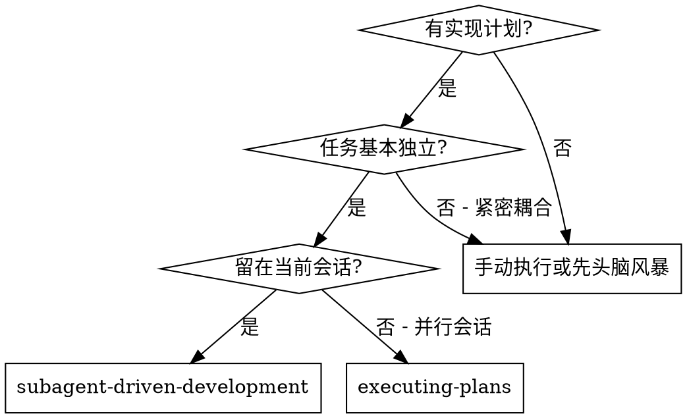
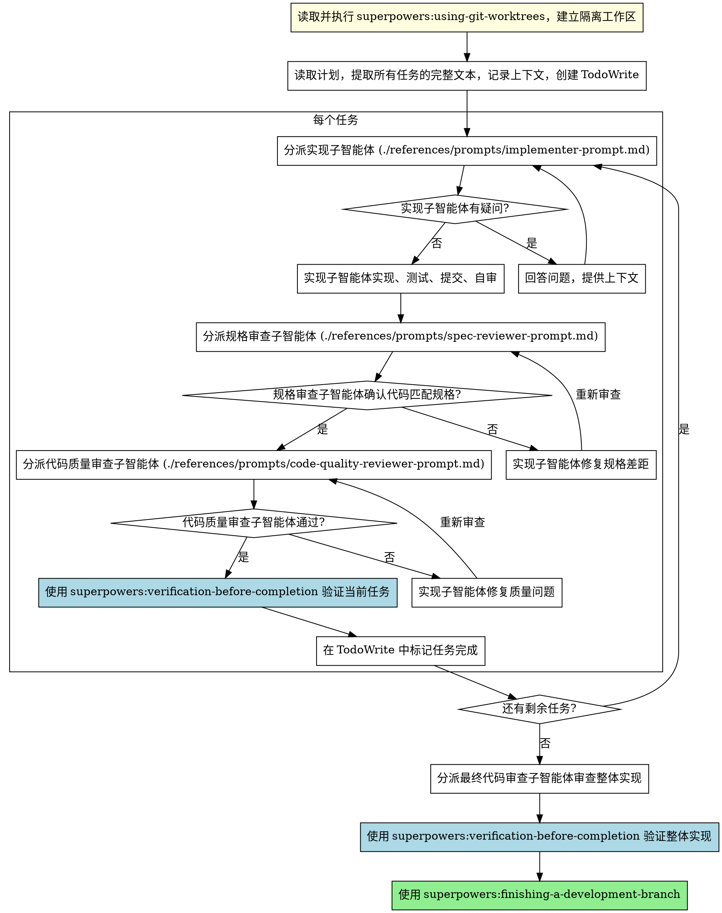

# 子智能体驱动开发

通过为每个任务分派一个全新的子智能体来执行计划，每个任务完成后进行两阶段审查：先审查规格合规性，再审查代码质量。

**为什么用子智能体：** 你将任务委派给具有隔离上下文的专用智能体。通过精心设计它们的指令和上下文，确保它们专注并成功完成任务。它们不应继承你的会话上下文或历史记录——你要精确构造它们所需的一切。这样也能为你自己保留用于协调工作的上下文。

**核心原则：** 每个任务一个全新子智能体 + 两阶段审查（先规格后质量）= 高质量、快速迭代

## 何时使用

**与 Executing Plans（并行会话）的对比：**
- 同一会话（无上下文切换）
- 每个任务全新子智能体（无上下文污染）
- 每个任务后两阶段审查：先规格合规性，再代码质量
- 更快的迭代（任务间无需人工介入）

## 流程

## 参考模块

以下内容已拆到 `references/`，避免主文件超过 300 行，并保持主文件只承载控制逻辑：

- `references/operator-guide.md`：模型选择、实现者状态处理、提示词模板
- `references/examples-and-rationale.md`：完整示例工作流、优势与成本说明

进入本技能后，按需读取：

1. 需要判断给实现者、规格审查者、代码质量审查者分配什么模型时，读取 `references/operator-guide.md`
2. 需要根据实现者返回状态决定下一步，或需要查看提示词模板时，读取 `references/operator-guide.md`
3. 需要完整演练一遍工作流、向用户解释为什么选这个技能，或查看优缺点时，读取 `references/examples-and-rationale.md`

## 红线

**绝不：**
- 未经用户明确同意就在 main/master 分支上开始实现
- 跳过 `superpowers:using-git-worktrees` 就直接在当前工作区开始实现
- 跳过 `superpowers:verification-before-completion` 就标记任务完成、进入下一个任务或宣称整体完成
- 跳过审查（规格合规性或代码质量）
- 带着未修复的问题继续
- 并行分派多个实现子智能体（会冲突）
- 让子智能体读取计划文件（应提供完整文本）
- 跳过场景铺设上下文（子智能体需要理解任务在哪个环节）
- 忽视子智能体的问题（在让它们继续之前先回答）
- 在规格合规性上接受"差不多就行"（规格审查者发现问题 = 未完成）
- 跳过审查循环（审查者发现问题 = 实现者修复 = 再次审查）
- 让实现者的自审替代正式审查（两者都需要）
- **在规格合规性审查通过之前开始代码质量审查**（顺序错误）
- 在任一审查有未解决问题时就进入下一个任务

**如果子智能体提问：**
- 清晰完整地回答
- 必要时提供额外上下文
- 不要催促它们进入实现阶段

**如果审查者发现问题：**
- 实现者（同一子智能体）修复
- 审查者再次审查
- 重复直到通过
- 不要跳过重新审查

**如果子智能体失败：**
- 分派修复子智能体并提供具体指令
- 不要尝试手动修复（上下文污染）

## 集成

选择本技能后，不要只读取本文件就开始执行。下面这些集成技能不是“背景参考”，而是分阶段生效的硬依赖。

### 进入本技能后的必做顺序

1. **开始实现前：** 先读取 `superpowers:using-git-worktrees`，建立隔离工作区；未完成这一步，不得开始实现。
2. **开始分派任务前：** 确认当前存在可执行计划；如果计划尚未产出或不够具体，先回到 `superpowers:writing-plans`。
3. **分派实现子智能体时：** 在分派说明里明确要求实现子智能体遵循 `superpowers:test-driven-development`。
4. **进入正式审查前：** 先读取 `superpowers:requesting-code-review`，按其审查模板和节奏组织审查上下文。
5. **标记任务完成或进入下一个任务前：** 先读取并执行 `superpowers:verification-before-completion`，确认当前任务已有新鲜验证证据。
6. **所有任务完成后：** 先读取并执行 `superpowers:verification-before-completion`，确认整体实现通过验证。
7. **准备收尾前：** 先读取 `superpowers:finishing-a-development-branch`，再进入收尾和交付。

### 阶段门槛

- 没有完成 `using-git-worktrees`，不能开始实现。
- 没有来自 `writing-plans` 的可执行任务清单，不能开始分派子智能体。
- 没有对实现子智能体显式施加 `test-driven-development`，不能宣称当前流程符合本技能要求。
- 没有进入 `requesting-code-review` 的审查模板流程，不能把规格审查和代码质量审查视为完整。
- 没有经过 `verification-before-completion`，不能标记任务完成、进入下一个任务或宣称整体完成。
- 没有进入 `finishing-a-development-branch`，不能把开发流程视为已收尾。

**必需的工作流技能：**
- **superpowers:using-git-worktrees** - 必需：在开始前建立隔离工作区
- **superpowers:writing-plans** - 创建本技能执行的计划
- **superpowers:requesting-code-review** - 审查子智能体的代码审查模板
- **superpowers:verification-before-completion** - 标记任务完成、进入下一个任务或整体收尾前执行验证
- **superpowers:finishing-a-development-branch** - 所有任务完成后收尾

**子智能体应使用：**
- **superpowers:test-driven-development** - 子智能体对每个任务遵循 TDD

**替代工作流：**
- **superpowers:executing-plans** - 用于并行会话而非同会话执行
