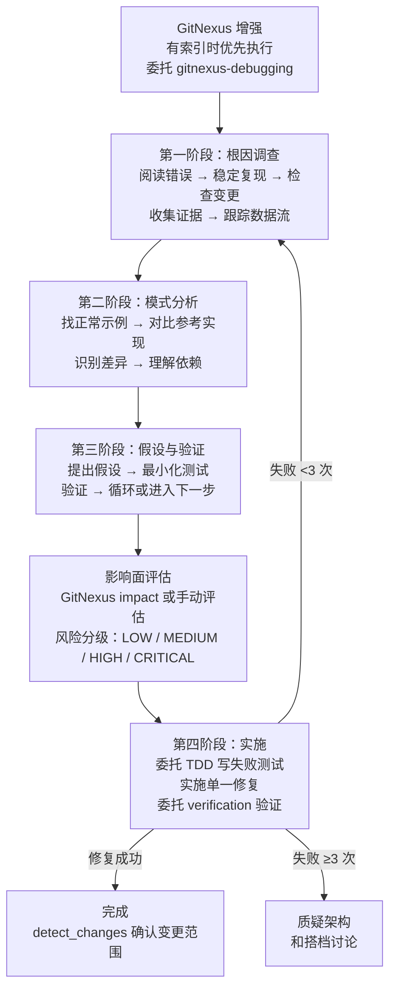

# 系统化调试（Systematic Debugging）

## 概述

系统化调试是一个强制根因调查的调试方法论。核心原则：**在尝试修复之前，务必先找到根本原因。只修症状就是失败。**

随意修复既浪费时间又会引入新 bug。草率的补丁只会掩盖深层问题。本技能通过四个阶段的严格流程，确保每次调试都能找到并修复真正的根因。

## 铁律

```
不做根因调查，不许提修复方案
```

如果你还没完成第一阶段，就不能提出修复方案。

## 作用场景

### 必须使用

用于任何技术问题：
- 测试失败
- 生产环境 bug
- 异常行为
- 性能问题
- 构建失败
- 集成问题

### 尤其在以下情况必须使用

- **时间紧迫**（紧急情况最容易让人猜测式修复）
- 觉得"一个小修改"就能搞定
- 已经尝试了多种修复
- 上一次修复没有生效
- 你没有完全理解问题

### 以下情况也不要跳过

- 问题看起来很简单（简单的 bug 也有根本原因）
- 你很赶时间（越急越容易返工）
- 领导要求立刻修好（系统化调试比反复尝试更快）

## 流程顺序



## 四个阶段详解

### GitNexus 增强（条件性前置步骤）

当项目已有 GitNexus 索引时，在第一阶段之前先执行 `gitnexus-debugging` 技能的工作流：
- `query`：查询 bug 相关的符号
- `context`：获取调用链上下文
- `process`：追踪执行流
- `cypher`：图谱查询定位可疑代码

**通过标准：** 能说出"bug 在哪个符号、属于哪个执行流、上下游是谁"。

> 如果 GitNexus 提示 "Index is stale" → 先跑 `npx gitnexus analyze`。没有索引则跳过此步。

### 第一阶段：根因调查

在尝试任何修复之前：

1. **仔细阅读错误信息** — 不要跳过错误或警告，完整阅读堆栈跟踪
2. **稳定复现** — 你能可靠地触发它吗？具体的复现步骤是什么？
3. **检查近期变更** — git diff、最近的提交、新依赖、配置变更
4. **在多组件系统中收集证据** — 对每个组件边界记录进入/离开的数据
5. **跟踪数据流** — 错误值从哪里产生的？谁用错误值调用了这里？

### 第二阶段：模式分析

先找到模式，再修复：

1. **找到可正常工作的示例** — 在同一代码库中找到类似的正常代码
2. **与参考实现对比** — 完整阅读参考实现，不要略读
3. **识别差异** — 列出每一个差异，不要假设"那不可能有影响"
4. **理解依赖关系** — 需要哪些设置、配置、环境？有哪些隐含假设？

### 第三阶段：假设与验证

科学方法：

1. **提出单一假设** — "我认为 X 是根本原因，因为 Y"
2. **最小化测试** — 每次只改一个变量
3. **继续之前先验证** — 生效了进入第四阶段，没生效提出新假设
4. **不确定时** — 说"我不理解 X"，寻求帮助

### 影响面评估（修复前必做）

修复前必须知道爆炸半径：

| 影响范围 | 风险等级 | 操作 |
|---------|---------|------|
| <5 符号，少量流程 | LOW | 直接修复 |
| 5-15 符号，2-5 流程 | MEDIUM | 修复后跑相关流程的测试 |
| >15 符号或大量流程 | HIGH | 修复后跑全量测试，考虑分步修复 |
| 关键路径（认证、支付） | CRITICAL | 和用户讨论方案后再动手 |

### 第四阶段：实施

修复根本原因，而非症状：

1. **创建失败的测试用例** — 委托 `superpowers:test-driven-development` 技能
2. **实施单一修复** — 每次只改一处，不做"顺便改改"的优化
3. **验证修复** — 委托 `superpowers:verification-before-completion` 技能 + `gitnexus_detect_changes` 确认变更范围
4. **修复不起作用？** — 少于 3 次回到第一阶段，3 次或以上质疑架构
5. **3 次以上失败** — 停下来质疑根本性问题，和搭档讨论

## 委托的子技能

| 子技能 | 在哪个阶段调用 | 用途 |
|--------|---------------|------|
| `gitnexus-debugging` | GitNexus 增强（前置） | 用知识图谱秒级定位调用链、影响面和可疑代码 |
| `superpowers:test-driven-development` | 第四阶段第 1 步 | 编写规范的失败测试（红-绿-重构纪律） |
| `superpowers:verification-before-completion` | 第四阶段第 3 步 | 运行验证命令，用证据支撑结论 |
| `gitnexus-impact-analysis` | 影响面评估 | 分析修改点的爆炸半径 |

## 红线——停下来，按流程走

如果你发现自己在想：
- "先临时修一下，以后再排查"
- "试着改改 X 看看行不行"
- "一次性改多个地方，跑测试看看"
- "跳过测试，我手动验证"
- "大概是 X 的问题，让我修一下"
- "我不完全理解，但这应该能行"
- 没有追踪数据流就提出解决方案
- "再试一次修复"（已经尝试了 2 次以上）
- 每次修复都暴露出不同地方的新问题
- 没有用 GitNexus 追踪就动手修复（有索引时）
- 没有写失败测试就开始修复
- 没有跑影响面分析就提交

**以上这些都意味着：停下来。回到第一阶段。**

## 搭档发出的信号

留意这些提醒：
- "难道不是这样吗？"——你在没有验证的情况下做了假设
- "它能告诉我们……吗？"——你应该先收集证据
- "别猜了"——你在没有理解的情况下提出修复
- "深入想想"——要质疑根本性问题，而不只是症状
- "我们卡住了？"（沮丧的语气）——你的方法没有奏效

**当你看到这些信号时：** 停下来。回到第一阶段。

## 常见借口

| 借口 | 现实 |
|------|------|
| "问题很简单，不需要走流程" | 简单问题也有根本原因。对简单 bug，流程很快就能走完。 |
| "紧急情况，没时间走流程" | 系统化调试比反复猜测式修复更快。 |
| "先试一下，再排查" | 第一次修复就定下了基调。从一开始就做对。 |
| "确认修复有效后再写测试" | 没有测试的修复留不住。先写测试才能证明修复有效。 |
| "一次修多个问题省时间" | 无法隔离哪个生效了。还会引入新 bug。 |
| "GitNexus 索引可能不准" | 不准就重新 analyze，不是跳过。 |
| "影响面分析太麻烦" | 不分析就提交，出了问题更麻烦。 |
| "这次情况特殊" | 没有例外。 |

## 速查表

| 阶段 | 关键活动 | 通过标准 |
|------|---------|---------|
| **GitNexus 增强** | 查询、上下文、执行流、图谱 | 能说出 bug 的符号和执行流 |
| **1. 根因** | 阅读错误、复现、检查变更、收集证据 | 理解了什么出了问题以及为什么 |
| **2. 模式** | 找到正常示例、对比 | 识别出差异 |
| **3. 假设** | 提出理论、最小化验证 | 假设被验证或产生新假设 |
| **影响面评估** | 分析爆炸半径、风险分级 | 确定风险等级和对应操作 |
| **4. 实施** | 创建测试、修复、验证 | bug 已修复，测试通过，变更范围符合预期 |

## 辅助技术

以下技术是系统化调试的组成部分，可在本目录中找到：

- **`root-cause-tracing.md`** - 沿调用栈反向追踪 bug，找到最初的触发点
- **`defense-in-depth.md`** - 找到根因后，在多个层级添加校验
- **`condition-based-waiting.md`** - 用条件轮询替代硬编码等待时间

## 实际效果

调试实践中的数据：
- 系统化方法：15-30 分钟修复
- 随意修复方法：2-3 小时反复折腾
- 一次修复成功率：95% vs 40%
- 引入新 bug：几乎为零 vs 经常发生

## 目录结构

```
systematic-debugging/
├── SKILL.md                          # 技能主文件（完整方法论）
├── README.md                         # 本文档（技能介绍和使用指南）
└── references/
    ├── gitnexus-toolkit.md           # GitNexus 工具速查（参数和示例）
    ├── root-cause-tracing.md         # 根因追踪技术
    ├── defense-in-depth.md           # 纵深防御技术
    └── condition-based-waiting.md    # 条件等待技术
```
