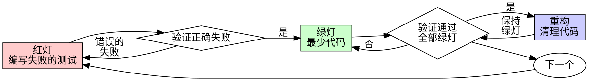

# 测试驱动开发（TDD）

## 概述

先写测试。看它失败。写最少的代码让它通过。

**核心原则：** 如果你没有看到测试失败，你就不知道它是否测试了正确的东西。

**违反规则的字面意思就是违反规则的精神。**

## 何时使用

新功能、Bug 修复、重构、行为变更——始终使用。

**例外（需询问你的人类伙伴）：** 一次性原型、生成的代码、配置文件。

## 铁律

```
没有失败的测试，就不写生产代码
```

先写了代码再写测试？删掉它。从头来过。不要保留、不要改编、不要看。从测试出发，重新实现。

## 红-绿-重构



### 红灯 - 编写失败的测试

写一个最小的测试来展示期望行为。

<Good>
```typescript
test('retries failed operations 3 times', async () => {
  let attempts = 0;
  const operation = () => {
    attempts++;
    if (attempts < 3) throw new Error('fail');
    return 'success';
  };

  const result = await retryOperation(operation);

  expect(result).toBe('success');
  expect(attempts).toBe(3);
});
```
名称清晰，测试真实行为，只测一件事
</Good>

<Bad>
```typescript
test('retry works', async () => {
  const mock = jest.fn()
    .mockRejectedValueOnce(new Error())
    .mockRejectedValueOnce(new Error())
    .mockResolvedValueOnce('success');
  await retryOperation(mock);
  expect(mock).toHaveBeenCalledTimes(3);
});
```
名称模糊，测试的是 mock 而非代码
</Bad>

**要求：** 一个行为、清晰的名称、使用真实代码（除非不得已才用 mock）。

### 验证红灯 - 看它失败

**必须执行。绝不跳过。**

```bash
npm test path/to/test.test.ts
```

确认：测试失败（不是报错）、失败信息符合预期、失败原因是功能缺失（不是拼写错误）。

**测试通过了？** 你在测试已有的行为。修改测试。

**测试报错了？** 修复错误，重新运行直到它正确地失败。

### 绿灯 - 最少代码

写最简单的代码让测试通过。

<Good>
```typescript
async function retryOperation<T>(fn: () => Promise<T>): Promise<T> {
  for (let i = 0; i < 3; i++) {
    try {
      return await fn();
    } catch (e) {
      if (i === 2) throw e;
    }
  }
  throw new Error('unreachable');
}
```
刚好够通过测试
</Good>

<Bad>
```typescript
async function retryOperation<T>(
  fn: () => Promise<T>,
  options?: {
    maxRetries?: number;
    backoff?: 'linear' | 'exponential';
    onRetry?: (attempt: number) => void;
  }
): Promise<T> {
  // YAGNI
}
```
过度设计
</Bad>

不要添加功能、重构其他代码或做超出测试要求的"改进"。

### 验证绿灯 - 看它通过

**必须执行。** 确认：测试通过、其他测试仍然通过、输出干净。

**测试失败了？** 修改代码，不是测试。**其他测试失败了？** 立即修复。

### 重构 - 清理代码

只有在绿灯之后才重构：消除重复、改善命名、提取辅助函数。保持测试绿灯。不要添加行为。

### 重复

为下一个功能写下一个失败的测试。

## 好的测试

| 特质 | 好的 | 差的 |
|------|------|------|
| **最小化** | 只测一件事。名称中有"和"？拆分它。 | `test('validates email and domain and whitespace')` |
| **清晰** | 名称描述行为 | `test('test1')` |
| **展示意图** | 展示期望的 API | 掩盖了代码应该做什么 |

## 验证清单

在标记工作完成之前：

- [ ] 每个新函数/方法都有测试
- [ ] 在实现之前看到每个测试失败
- [ ] 每个测试因预期原因失败（功能缺失，不是拼写错误）
- [ ] 为每个测试编写了最少代码使其通过
- [ ] 所有测试通过
- [ ] 输出干净（没有错误、警告）
- [ ] 测试使用真实代码（只在不可避免时用 mock）
- [ ] 覆盖了边界情况和错误场景

不能全部勾选？你跳过了 TDD。从头开始。

## TDD 完成后的衔接

TDD 的红-绿-重构验证的是**每个行为的正确性**（测试先失败后通过）。

但这不等同于**任务完成**。当前 TDD 任务的循环全部结束后，不能直接宣称任务完成，最终必须经过 `superpowers:verification-before-completion` 做完成声明验证：

- TDD 验证：每个测试红-绿循环已走完 → 证明代码做了正确的事
- verification-before-completion 验证：所有证据新鲜且完整 → 证明你有权说"完成了"

跳过 verification-before-completion 直接宣称完成，等于用技术正确性替代了需求满足度——测试全过不代表需求全实现。

**在编排型工作流中（如 page-development-workflow），** 由工作流管理 TDD → verification 的转换时机，TDD 任务完成后回到工作流继续下一步，而非自行跳转到 verification-before-completion。

## 遇到困难时

| 问题 | 解决方案 |
|------|----------|
| 不知道怎么测试 | 写出你期望的 API。先写断言。问你的人类伙伴。 |
| 测试太复杂 | 设计太复杂。简化接口。 |
| 必须 mock 所有东西 | 代码耦合太紧。使用依赖注入。 |
| 测试 setup 太庞大 | 提取辅助函数。还是复杂？简化设计。 |

## 调试集成

发现 bug？写一个重现 bug 的失败测试。按 TDD 循环走。测试既证明了修复有效，又防止了回归。

绝不在没有测试的情况下修复 bug。

## 测试反模式

添加 mock 或测试工具时，阅读 `references/testing-anti-patterns.md` 以避免常见陷阱。

## 最终规则

```
生产代码 → 测试存在且先失败
否则 → 不是 TDD
```

没有你的人类伙伴的许可，没有例外。

## References 读取条件

| 文件 | 什么时候读 |
|------|-----------|
| `references/anti-rationalization.md` | 想着"就这一次跳过 TDD"或"这次情况不同"时 |
| `references/testing-anti-patterns.md` | 添加 mock 或测试工具时 |
