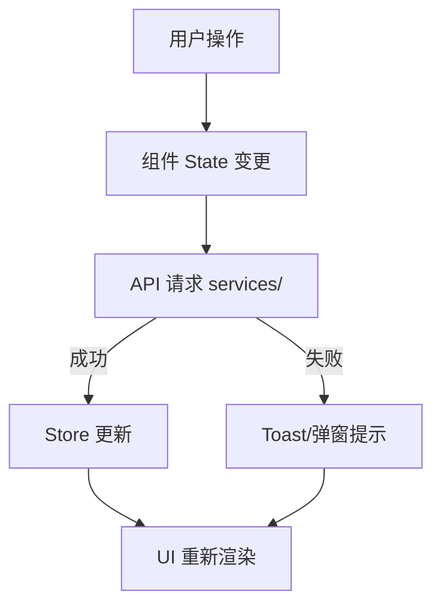

| **文档编号**：     |                             |
| ------------------ | --------------------------- |
| **需求名称**：     | {需求名称}                  |
| **需求ID**：       |                             |
| **前端 Owner**：   | {姓名}                      |
| **文档状态**：     | {起草中/评审中/已定稿}      |
| **最后更新时间**： |                             |

# 1. 需求概述

## 背景

{业务背景描述，说明本次需求要解决的核心问题和驱动因素}

## 需求和任务

> **填写说明：** 按照页面或功能模块拆分任务清单，每项标注优先级（P0/P1/P2）。

- {页面/模块A}
  - {任务A1}（P0）
  - {任务A2}（P1）
- {页面/模块B}
  - {任务B1}（P0）
  - {任务B2}（P1）
- {跨端/通用能力}
  - {任务C1}（P2）

# 2. 技术选型

> **填写说明：** 列出当前功能所需的技术方案，仅包含与本次需求直接相关的技术选型，不要复制项目全量技术栈。

| 维度 | 方案 | 版本 | 是否新增 | 说明{参考} |
| ---- | ---- | ---- | :------: | ---------- |
| {维度，如：状态管理} | {方案，如：Zustand} | {版本，如：4.x} | ✓/✗ | {说明，如：轻量、TS友好}{参考链接} |

# 3. 架构设计

> **填写说明：** 架构图使用 Mermaid 或 Draw.io 绘制，流程图覆盖主流程与异常分支，目录结构仅列本次新增或变更的目录。没有可删除本章节。

## 架构图

> 示例：组件层级、模块依赖、数据流向等

## 流程图

> 示例：用户操作主流程、异常分支、条件判断

## 目录结构

> 仅列出本次需求的使用目录，不要复制全量项目结构。

# 4. 核心技术设计

> **填写说明：** 记录功能中有技术难度或需要专门设计的关键实现，如地图渲染、文件分片上传、实时通信等。没有可删除本章节。

## {技术点名称}

### 技术方案

{方案描述，包含选型依据、核心思路、关键实现逻辑}

# 5. 核心功能模块

## 模块概览

| 模块 | 页面 | 路由 | 负责人 | 说明 |
|------|------|------|--------|------|
| {模块A} | {页面A} | `/{path}` | {姓名} | {说明} |
| {模块A} | {页面B} | `/{path}` | {姓名} | {说明} |
| {模块B} | {页面C} | `/{path}` | {姓名} | {说明} |

---

## {页面名称}

| 属性 | 内容 |
|------|------|
| 路由 | `/{path}` |
| 目标用户 | {角色} |
| 功能概述 | {功能描述} |
| 需求文档 | [{PRD 名称}]({url}) |
| 设计稿 | [{Figma 页面名称}]({url}) |
| 接口文档 | [{Swagger 接口组}]({url}) |
| 相关方案 | [{关联技术方案名称}]({url}) |

### 页面架构

```
{ASCII 页面布局图}
```

### 流程图和数据流



### 字段规格

**表单字段**

| 字段名称 | 字段类型 | 是否必填 | 交互规则 |
| -------- | -------- | :------: | -------- |
| {字段1}  | {类型}   |   ✓/✗    | {规则}   |

**列表字段**

| 字段名称 | 字段类型 | 说明 |
| -------- | -------- | ---- |
| {字段1}  | {类型}   | {说明} |

**筛选字段**

| 字段名称 | 字段类型 | 默认值 | 说明 |
| -------- | -------- | ------ | ---- |
| {字段1}  | {类型}   | {默认值} | {说明} |

### 交互规则

| 序号 | 操作   | 行为       |
| :--: | ------ | ---------- |
|  1   | {操作} | {预期行为} |

### 异常逻辑

| 异常场景 | 处理逻辑   |
| -------- | ---------- |
| {场景}   | {处理方式} |

### 组件

**使用矩阵**

| 组件 / 页面       | {页面A} | {页面B} | 类型     | 用途       |
| ----------------- | :-----: | :-----: | -------- | ---------- |
| `{BusinessComp}`  |    ✅    |    -    | 业务组件 | {用途说明} |
| `{CommonComp}`    |    ✅    |    ✅    | 公共组件 | {用途说明} |

**业务组件明细**

| 组件              | 用途       | 关联状态     |
| ----------------- | ---------- | ------------ |
| `{ComponentName}` | {用途说明} | `{stateKey}` |

### hooks

**使用矩阵**

| Hook / 页面       | {页面A} | {页面B} | 来源   | 用途       |
| ----------------- | :-----: | :-----: | ------ | ---------- |
| `use{Feature}`    |    ✅    |    -    | 内部   | {用途说明} |
| `use{CommonHook}` |    ✅    |    ✅    | 公共   | {用途说明} |

**内部 hooks 明细**

| Hook           | 用途   | 依赖            |
| -------------- | ------ | --------------- |
| `use{Feature}` | {说明} | `{API / Store}` |

### utils

**使用矩阵**

| 函数 / 页面       | {页面A} | {页面B} | 来源   | 用途       |
| ----------------- | :-----: | :-----: | ------ | ---------- |
| `{utilName}()`    |    ✅    |    -    | 内部   | {用途说明} |
| `{commonUtil}()`  |    ✅    |    ✅    | 公共   | {用途说明} |

**内部 utils 明细**

| 函数           | 用途   |
| -------------- | ------ |
| `{utilName}()` | {说明} |

### constants

**使用矩阵**

| 常量 / 页面        | {页面A} | {页面B} | 来源   | 用途       |
| ------------------ | :-----: | :-----: | ------ | ---------- |
| `{CONST_NAME}`     |    ✅    |    -    | 内部   | {用途说明} |
| `{COMMON_CONST}`   |    ✅    |    ✅    | 公共   | {用途说明} |

**内部 constants 明细**

| 常量           | 值        | 说明   |
| -------------- | --------- | ------ |
| `{CONST_NAME}` | `{value}` | {说明} |

# 6. 公共依赖

> **填写说明：** 集中列出本次需求涉及的公共（跨模块复用）Store、hooks、utils、constants，不重复展开设计细节。没有可删除本章节。

## 公共 Store

| Store               | 关键字段          | 使用页面   | 依赖 Store     | 说明         |
| -------------------- | ----------------- | ---------- | -------------- | ------------ |
| `use{Feature}Store`  | `{data}, loading` | {页面列表} | `useAuthStore` | {用途说明}   |

## 公共 hooks

| Hook              | 用途       | 使用页面   | 依赖            |
| ----------------- | ---------- | ---------- | --------------- |
| `use{CommonHook}` | {用途说明} | {页面列表} | `{API / Store}` |

## 公共 utils

| 函数             | 用途       | 使用页面   |
| ---------------- | ---------- | ---------- |
| `{commonUtil}()` | {用途说明} | {页面列表} |

## 公共 constants

| 常量             | 值        | 用途       | 使用页面   |
| ---------------- | --------- | ---------- | ---------- |
| `{COMMON_CONST}` | `{value}` | {用途说明} | {页面列表} |

# 7. 公共组件设计

> **填写说明：** 仅列出跨页面复用、需要独立设计的公共组件。页面内部业务组件在 #5 业务组件明细表中展开。

## 组件树

## 使用矩阵

| 页面/功能 | {组件A} | {组件B} | {组件C} |
| --------- | :-----: | :-----: | :-----: |
| {页面1}   |    ✅    |    -    |    ✅    |
| {页面2}   |    -    |    ✅    |    ✅    |

## {组件名称}

### 组件职责

{组件职责描述，说明组件解决的问题和适用场景}

### 组件 Props

```typescript
interface {ComponentName}Props {
  /** {字段说明} */
  {propName}: {type};
  /** {字段说明} */
  {propName}?: {type};
}
```

| Props             | 类型     | 默认值     | 必填 | 说明       |
| ----------------- | -------- | ---------- | :--: | ---------- |
| `{propName}`      | `{type}` | `{default}` | ✓/✗ | {说明}     |

# 8. 接口与数据定义

## API 接口规划

| 接口路径                 | 方法 | swagger地址 | 使用矩阵 | 说明                         |
| ------------------------ | ---- | ----------- | -------- | ---------------------------- |
| `/api/{resource}/list`   | GET  |             |          | {资源}列表（支持分页、筛选） |
| `/api/{resource}/create` | POST |             |          | 创建{资源}                   |
| `/api/{resource}/:id`    | PUT  |             |          | 更新{资源}                   |

## {接口名称}

### 接口参数定义

**请求参数**

| 参数名称 | 参数类型 | 是否必填 | 说明 |
| -------- | -------- | :------: | ---- |
| {参数1}  | {类型}   |   ✓/✗    | {说明} |

**响应数据**

```typescript
interface {InterfaceName}Response {
  /** {字段说明} */
  {fieldName}: {type};
  /** {字段说明} */
  {fieldName}?: {type};
}
```

| 字段名称       | 字段类型 | 说明       |
| -------------- | -------- | ---------- |
| `{fieldName}`  | `{type}` | {说明}     |

# 9. 非功能性需求（NFR）

## 性能

| 指标             | 目标值   | 说明                 |
| ---------------- | -------- | -------------------- |
| 首屏加载         | < 2s     | 弱网环境首屏可交互时间 |
| 接口响应         | < 500ms  | P95 接口耗时          |
| 大列表渲染       | < 100ms  | 虚拟滚动或分页加载    |

## 兼容性

| 维度           | 要求               | 说明                     |
| -------------- | ------------------ | ------------------------ |
| 浏览器         | Chrome 90+         | 企业内网主流版本         |
| 移动端         | 微信小程序基础库 2.25+ | 最低兼容版本           |
| 分辨率         | 1280×720 ~ 1920×1080 | 主流桌面分辨率        |

## 安全性

| 场景           | 措施               |
| -------------- | ------------------ |
| XSS 防护       | 输入转义、CSP 策略 |
| 敏感数据       | 脱敏展示、加密传输 |
| 权限控制       | 按钮/菜单级鉴权    |

## 用户体验

| 场景             | 要求               |
| ---------------- | ------------------ |
| 加载状态         | 骨架屏或 Spin 提示 |
| 操作反馈         | 成功/失败 Toast    |
| 空状态           | 空数据引导插图     |

# 10. 测试策略

| 测试类型 | 覆盖范围 | 目标覆盖率 | 工具 |
| -------- | -------- | ---------- | ---- |
| 单元测试 | hooks、utils、核心逻辑 | {覆盖率} | {工具} |
| 组件测试 | 公共组件、复杂业务组件 | {覆盖率} | {工具} |
| E2E 测试 | 核心业务流程 | {覆盖率} | {工具} |

# 11. 风险评估与应对

## 技术风险

| 风险项                           | 影响       |   概率   | 应对策略   |
| -------------------------------- | ---------- | :------: | ---------- |
| {风险描述，如：低版本浏览器兼容} | {影响范围} | 高/中/低 | {应对措施} |

## 业务风险

| 风险项                       | 影响       |   概率   | 应对策略   |
| ---------------------------- | ---------- | :------: | ---------- |
| {风险描述，如：需求变更频繁} | {影响范围} | 高/中/低 | {应对措施} |

## 依赖风险

| 风险项                            | 影响       |   概率   | 应对策略   |
| --------------------------------- | ---------- | :------: | ---------- |
| {风险描述，如：第三方 SDK 不稳定} | {影响范围} | 高/中/低 | {应对措施} |

# 12. 工作量评估

## 12.1 PERT 估算

| 估算类型                           | 人日    |
| ---------------------------------- | ------- |
| 乐观（O）                          | 1.0     |
| 悲观（P）                          | 2.0     |
| 最可能（M）                        | 1.5     |
| **PERT 期望值** `(O + 4M + P) / 6` | **1.5** |

## 12.2 拆分明细

| 阶段               | 工作内容                               | 人日    |
| ------------------ | -------------------------------------- | ------- |
| 核心开发           | 组件开发、API 接入、状态管理、表单校验 | 1.0     |
| 自测 & 联调        | 单元测试编写、前后端联调               | 0.4     |
| Code Review & 修改 | PR 评审、修改反馈                      | 0.1     |
| 缓冲时间           | 应对不确定性                           | 0.2     |
| **合计**           |                                        | **1.7** |

# 附录：变更记录

| 版本 | 日期 | 修改人 | 修改内容 |
| ---- | ---- | ------ | -------- |
| v1.0 | {日期} | {姓名} | 初稿 |
