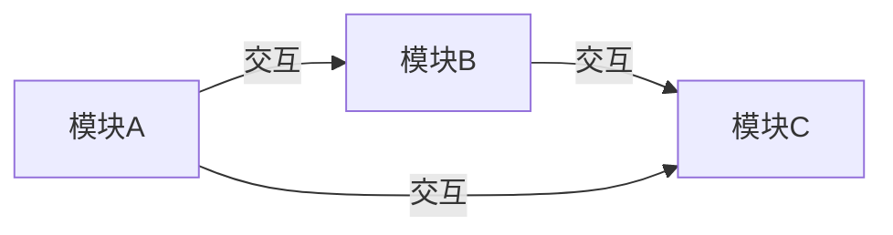
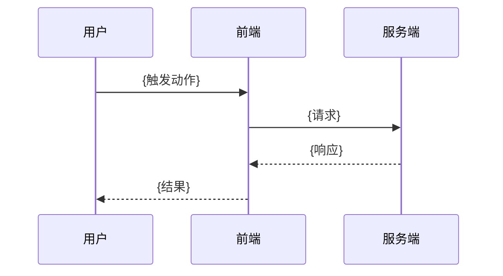

| **文档编号**：     |                             |
| ------------------ | --------------------------- |
| **方案名称**：     | {技术方案名称}              |
| **方案 Owner**：   | {姓名}                      |
| **关联需求**：     | {需求名称 / ID}             |
| **文档状态**：     | {起草中/评审中/已定稿}      |
| **最后更新时间**： |                             |

# 1. 方案概述

> **填写说明：** 说明本方案要解决的技术问题、目标与边界。这是一份「技术难点」导向的文档，不承载业务需求描述。

## 背景与问题

{描述当前技术痛点、现有实现的问题、触发本次技术方案的原因}

## 目标

- {目标1}
- {目标2}
- {目标3}

## 非目标

- {明确本次不做的事}
- {如：不涉及跨平台、不覆盖边缘场景}

## 术语表

| 术语 | 说明 |
| ---- | ---- |
| {术语} | {说明} |

# 2. 方案选型

> **填写说明：** 列出 2-3 个候选方案，说明各自的优劣，并给出最终选型结论与依据。

## 候选方案对比

| 方案 | 思路 | 优点 | 缺点 | 适用场景 |
| ---- | ---- | ---- | ---- | -------- |
| 方案A：{名称} | {思路} | {优点} | {缺点} | {场景} |
| 方案B：{名称} | {思路} | {优点} | {缺点} | {场景} |
| 方案C：{名称} | {思路} | {优点} | {缺点} | {场景} |

## 选型结论

**最终选择：{方案}**

- {选型依据1}
- {选型依据2}
- {选型依据3}

# 3. 架构设计

> **填写说明：** 用架构图、时序图和数据流描述整体设计。图片用 Mermaid 或 Draw.io 绘制。

## 架构图



## 时序图



## 数据流

```
{步骤1} → {步骤2} → {步骤3} → {步骤4}
```

# 4. 核心设计

> **填写说明：** 拆解方案中的技术难点，逐个说明设计思路与关键决策。没有可删除本章节。

## 4.1 {技术难点1}

{描述该难点的设计思路、关键决策、取舍依据}

| 决策点 | 结论 | 说明 |
| ------ | ---- | ---- |
| {决策点1} | {结论} | {说明} |
| {决策点2} | {结论} | {说明} |

## 4.2 {技术难点2}

{描述该难点的设计思路、关键决策、取舍依据}

| 配置项 | 值 | 说明 |
| ------ | --- | ---- |
| {配置项1} | {值} | {说明} |
| {配置项2} | {值} | {说明} |

## 4.3 {技术难点3}

{描述该难点的设计思路、关键决策、取舍依据}

# 5. 接口与数据定义

> **填写说明：** 列出本方案涉及的接口、关键字段与配置项。接口信息以 swagger 或真实响应为准。

## 接口概览

| 接口路径 | 方法 | 用途 | swagger 地址 |
| -------- | ---- | ---- | ------------ |
| `/api/{resource}/{action}` | {方法} | {用途} | |
| `/api/{resource}/{action}` | {方法} | {用途} | |

## {接口名称}

### 请求参数

| 参数名称 | 参数类型 | 是否必填 | 说明 |
| -------- | -------- | :------: | ---- |
| {参数1}  | {类型}   |   ✓/✗    | {说明} |

### 响应数据

```typescript
interface {InterfaceName}Response {
  /** {字段说明} */
  {fieldName}: {type};
}
```

## 关键配置项

| 配置项 | 值 | 说明 |
| ------ | --- | ---- |
| {配置项1} | {值} | {说明} |
| {配置项2} | {值} | {说明} |

# 6. 关键实现

> **填写说明：** 用伪代码或代码模式表达核心实现逻辑，不追求可运行，只表达关键思路。

```typescript
// {功能名} 核心实现示例
async function {functionName}(input) {
  // 1. {步骤1}
  // 2. {步骤2}
  // 3. {步骤3}
}
```

| 实现要点 | 说明 |
| -------- | ---- |
| {要点1} | {说明} |
| {要点2} | {说明} |

# 7. 异常与边界处理

> **填写说明：** 覆盖失败重试、超时、并发、边界值等异常场景的处理方式。

| 异常场景 | 处理方式 | 用户感知 |
| -------- | -------- | -------- |
| {异常场景1} | {处理方式} | {用户感知} |
| {异常场景2} | {处理方式} | {用户感知} |
| {异常场景3} | {处理方式} | {用户感知} |

# 8. 性能优化

> **填写说明：** 列出针对本方案的性能优化措施与目标指标。

| 优化项 | 措施 | 目标 |
| ------ | ---- | ---- |
| {优化项1} | {措施} | {目标} |
| {优化项2} | {措施} | {目标} |
| {优化项3} | {措施} | {目标} |

# 9. 安全与合规

| 场景 | 措施 |
| ---- | ---- |
| {安全场景1} | {措施} |
| {安全场景2} | {措施} |
| {安全场景3} | {措施} |

# 10. 测试策略

## 自动化测试

| 测试类型 | 覆盖范围 | 工具 |
| -------- | -------- | ---- |
| 单元测试 | {覆盖范围} | {工具} |
| 集成测试 | {覆盖范围} | {工具} |

## 测试用例清单

- [ ] {测试点1}
- [ ] {测试点2}
- [ ] {测试点3}

## 手动验收

- [ ] {验收项1}
- [ ] {验收项2}
- [ ] {验收项3}

# 11. 风险与落地

## 风险与应对

| 风险 | 影响 | 概率 | 应对 |
| ---- | ---- | ---- | ---- |
| {风险1} | {影响} | {概率} | {应对} |
| {风险2} | {影响} | {概率} | {应对} |

## 依赖清单

| 依赖 | 用途 | 版本 |
| ---- | ---- | ---- |
| {依赖1} | {用途} | {版本} |

## 工作量评估

| 任务 | 人天 | 说明 |
| ---- | ---- | ---- |
| {任务} | {人天} | {说明} |
