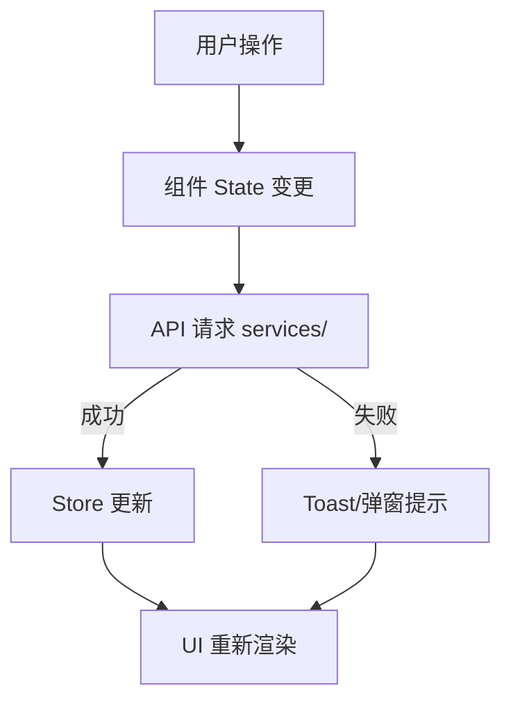

# 一、项目概述

| 维度         | 说明           |
| ------------ | -------------- |
| **项目名称** | {项目名称}     |
| **项目定位** | {项目定位描述} |
| **技术栈**   | {技术栈列表}   |
| **核心场景** | {核心业务场景} |

---

# 二、项目架构

## 架构图

## 流程图

## 目录结构

```
project-name/
├── config/                              # 环境变量配置
│   ├── .env                             # 本地开发
│   ├── .env.test                        # 测试环境
│   └── .env.prod                        # 生产环境
│
├── mock/                                # Mock API
│   └── {module}.js                      # 业务模块 Mock
│
├── plugins/                             # 构建插件
│   ├── index.ts
│   └── vite-plugin-{name}.ts
│
├── public/                              # 静态资源（不经编译）
│
├── src/
│   ├── main.tsx                         # 入口文件
│   ├── App.tsx                          # 根组件
│   ├── env.d.ts                         # 类型声明
│   │
│   ├── pages/                           # 页面目录
│   │   ├── index.tsx                    # 默认页（重定向）
│   │   │
│   │   ├── {page-name}/                 # 业务页面
│   │   │   ├── index.tsx                # 页面入口
│   │   │   ├── types.ts                 # 页面级类型
│   │   │   ├── components/              # 页面私有组件
│   │   │   │   └── {ComponentName}/
│   │   │   │       ├── index.tsx
│   │   │   │       └── index.less
│   │   │   └── hooks/                   # 页面私有 Hooks
│   │   │       └── use{Feature}.ts
│   │   │
│   │   └── routes.tsx                   # 路由配置
│   │
│   ├── components/                      # 通用业务组件
│   │   └── {ComponentName}/
│   │       ├── index.tsx
│   │       ├── index.less
│   │       └── types.ts
│   │
│   ├── layouts/                         # 布局组件
│   │   └── {LayoutName}.tsx
│   │
│   ├── stores/                          # 全局状态管理（Zustand）
│   │   └── use{Feature}Store.ts
│   │
│   ├── services/                        # API 接口请求
│   │   └── {ServiceName}/
│   │       └── index.ts
│   │
│   ├── types/                           # 全局通用类型
│   │   ├── global.d.ts
│   │   ├── {module}.ts
│   │   └── common.ts                    # 通用类型（分页、筛选等）
│   │
│   ├── constants/                       # 常量/枚举
│   │   ├── enums.ts
│   │   └── {domain}.ts
│   │
│   ├── hooks/                           # 全局公共 Hooks
│   │   └── use{Feature}.ts
│   │
│   ├── utils/                           # 工具函数
│   │   ├── index.ts
│   │   ├── request/                     # API 请求封装
│   │   │   └── index.ts
│   │   ├── format/                      # 格式化工具
│   │   │   └── index.ts
│   │   └── validate/                    # 表单校验
│   │       └── index.ts
│   │
│   └── assets/                          # 静态资源
│       └── styles/
│           ├── variables.css            # CSS 变量
│           └── global.css               # 全局样式
│
├── package.json
├── tsconfig.json
├── vite.config.ts
└── README.md
```

# 三、技术选型

| 维度          | 方案        | 版本   | 说明{参考} |
| ------------- | ----------- | ------ | ---------- |
| **构建工具**  | {构建工具}  | {版本} | {说明}     |
| **框架**      | {框架}      | {版本} | {说明}     |
| **UI 组件库** | {UI 库}     | {版本} | {说明}     |
| **样式方案**  | {样式方案}  | {版本} | {说明}     |
| **路由**      | {路由方案}  | {版本} | {说明}     |
| **状态管理**  | {状态管理}  | {版本} | {说明}     |
| **图表**      | {图表库}    | {版本} | {说明}     |
| **Mock**      | {Mock 方案} | {版本} | {说明}     |

# 四、路由设计

采用 Hash 路由模式（移动端更稳定）。

| 路由路径  | 页面名称 | 权限   | 说明   |
| --------- | -------- | ------ | ------ |
| `/`       | {首页}   | {角色} | {说明} |
| `/{path}` | {页面名} | {角色} | {说明} |

# 五、状态管理

## 使用矩阵

| 消费者 Store        | 依赖的 Store   | 依赖字段 | 说明             |
| ------------------- | -------------- | -------- | ---------------- |
| `use{Feature}Store` | `useAuthStore` | `userId` | 拉取当前用户数据 |

## Store 

```typescript
// src/stores/use{Feature}Store.ts
interface {Feature}Store {
  {data}: {Type}[];
  loading: boolean;

  fetch{Feature}: () => void;
  add{Feature}: (item: {Type}) => void;
  update{Feature}: (id: string, updates: Partial<{Type}>) => void;
  remove{Feature}: (id: string) => void;
}
```

## Storage

| Key               | 内容     | 存储方式       | 过期策略   | 说明         |
| ----------------- | -------- | -------------- | ---------- | ------------ |
| `{TOKEN_KEY}`     | 登录凭证 | localStorage   | 退出时清除 | 接口鉴权     |
| `{USER_INFO_KEY}` | 用户信息 | localStorage   | 退出时清除 | 头像、昵称等 |
| `{CACHE_KEY}`     | 业务缓存 | sessionStorage | 关闭标签页 | {说明}       |

# 六、UI设计

## 设计规范

| 维度 | 规范 | 说明 |
| ---- | ---- | ---- |
| 色彩系统 | {主色/辅助色/功能色值} | {说明} |
| 字体系统 | {字族/字号/行高} | {说明} |
| 间距系统 | {基础间距网格，如：4px 增量} | {说明} |
| 圆角规范 | {大/中/小圆角值} | {说明} |
| 阴影规范 | {层级阴影值} | {说明} |

## 页面布局

```
{ASCII 页面布局图}
```

## 组件状态规范

| 状态 | 展示内容 | 触发条件 |
| ---- | -------- | -------- |
| 加载中 | 骨架屏 / Spin 加载 | 数据请求发起时 |
| 空状态 | 空数据插图 + 引导文案 | 列表无数据 |
| 错误状态 | 错误提示 + 重试按钮 | 接口请求失败 |
| 成功状态 | 成功 Toast / 消息提示 | 操作成功完成 |

## 交互反馈规范

| 交互类型 | 反馈方式 | 持续时间 | 说明 |
| -------- | -------- | :------: | ---- |
| 操作成功 | Toast / 消息提示 | 3s | 页面内单独处理 |
| 操作失败 | 全局错误提示 | 持久 | 统一错误拦截处理 |
| 加载反馈 | Button loading / Spin | 请求期间 | 防止重复提交 |
| 确认操作 | Modal 弹窗确认 | 用户响应 | 删除等危险操作 |

# 七、公共依赖

> **填写说明：** 集中列出项目涉及的公共（跨模块复用）Store、hooks、utils、constants，不重复展开设计细节。没有可删除本章节。

## 公共 hooks

| Hook | 用途 | 使用模块 | 依赖 |
| ---- | ---- | -------- | ---- |
| `use{CommonHook}` | {用途说明} | {模块列表} | `{API / Store}` |

## 公共 utils

| 函数 | 用途 | 使用模块 |
| ---- | ---- | -------- |
| `{commonUtil}()` | {用途说明} | {模块列表} |

## 公共 constants

| 常量 | 值 | 用途 | 使用模块 |
| ---- | --- | ---- | -------- |
| `{COMMON_CONST}` | `{value}` | {用途说明} | {模块列表} |

# 八、公共组件设计

## 使用矩阵

| 页面/功能 | {组件A} | {组件B} | {组件C} |
| --------- | :-----: | :-----: | :-----: |
| {页面1}   |    ✅    |    -    |    ✅    |
| {页面2}   |    -    |    ✅    |    ✅    |

## {组件名称}

```typescript
// src/components/{ComponentName}/index.tsx

import React from 'react';
import './index.less';

export interface {ComponentName}Props {
  /** 属性说明 */
  value?: string;
  /** 回调说明 */
  onChange?: (value: string) => void;
}

const {ComponentName}: React.FC<{ComponentName}Props> = (props) => {
  const { value, onChange } = props;
  return <div className="{component-class}">{value}</div>;
};

export default {ComponentName};
```

# 九、接口与数据定义

## API 接口规范

> 通用 API 调用规范说明，涵盖请求格式、响应结构、错误码定义和错误处理策略。

### 请求规范

| 规范项 | 说明 |
| ------ | ---- |
| 请求方式 | RESTful（GET / POST / PUT / DELETE） |
| 基础路径 | `/api/{version}` |
| 请求头 | `Content-Type: application/json`；携带 `Authorization: Bearer {token}` |
| 参数传递 | GET 使用 Query 参数，POST/PUT 使用 Body（JSON） |

### 响应格式定义

> 后端统一响应结构，前端基于此做统一拦截和逐页面提示。

```typescript
/** 统一 API 响应结构 */
interface ApiResponse<T = unknown> {
  /** 业务状态码：0 表示成功，非 0 表示具体错误类型 */
  code: number;
  /** 响应数据 */
  data: T;
  /** 提示信息，成功/失败时由后端返回 */
  message: string;
}
```

| 字段 | 类型 | 必选 | 说明 |
| ---- | ---- | :--: | ---- |
| `code` | `number` | ✓ | 业务状态码，详见错误码定义 |
| `data` | `T` | ✗ | 响应数据，成功时必含 |
| `message` | `string` | ✓ | 提示信息，用于前端展示 |

### 错误码定义

| 错误码 | 含义 | 前端处理方式 |
| :----: | ---- | ------------ |
| `0` | 成功 | 正常解析 `data`，由页面内部处理成功提示 |
| `400` | 请求参数错误 | 表单字段高亮提示具体错误 |
| `401` | 未认证 / Token 过期 | 清除登录态，跳转登录页 |
| `403` | 无权限访问 | 展示「无权限」提示 |
| `404` | 资源不存在 | 展示 404 提示 |
| `500` | 服务器内部错误 | 全局错误 Toast |
| `{业务码}` | {业务错误描述} | {处理方式} |

### 统一错误处理

> 全局 HTTP 拦截器统一处理（axios interceptors / fetch wrapper），页面内只需关注成功分支。

```typescript
/** HTTP 拦截器统一处理逻辑 */
// 1. 401 → 清除 token，跳转 /login
// 2. 403 → 全局弹窗提示 "无权限访问"
// 3. 5xx → 全局 Toast "服务器繁忙，请稍后重试"
// 4. 业务 code !== 0 → 按业务码分发处理
// 5. 网络错误 → 全局 Toast "网络连接异常"
```

### 成功提示策略

> 操作成功由页面内部组件单独处理，不做全局统一提示。

| 场景 | 提示方式 | 示例 |
| ---- | -------- | ---- |
| 创建成功 | Toast "创建成功" | 表单页内 Toast |
| 更新成功 | Toast "更新成功" | 编辑页内 Toast |
| 删除成功 | Toast "删除成功" | 确认弹窗后 Toast |
| 批量操作 | Toast "操作成功（共 {n} 条）" | 列表页内 Toast |

## API 接口规划

| 接口路径 | 方法 | Swagger 地址 | 使用模块 | 说明 |
| -------- | ---- | ------------ | -------- | ---- |
| `/api/{resource}/list` | GET | | | {资源}列表（支持分页、筛选）|
| `/api/{resource}/create` | POST | | | 创建{资源} |
| `/api/{resource}/:id` | PUT | | | 更新{资源} |
| `/api/{resource}/:id` | DELETE | | | 删除{资源} |

### {接口名称}

#### 接口参数定义

**请求参数**

| 参数名称 | 参数类型 | 是否必填 | 说明 |
| -------- | -------- | :------: | ---- |
| {参数1} | {类型} | ✓/✗ | {说明} |

**响应数据**

```typescript
interface {InterfaceName}Response {
  /** {字段说明} */
  {fieldName}: {type};
  /** {字段说明} */
  {fieldName}?: {type};
}
```

| 字段名称 | 字段类型 | 说明 |
| -------- | -------- | ---- |
| `{fieldName}` | `{type}` | {说明} |

# 十、核心技术设计

> **填写说明：** 记录项目中有技术难度或需要专门设计的关键实现，如地图渲染、文件分片上传、实时通信等。没有可删除本章节。

## {技术点名称}

### 技术方案

{方案描述，包含选型依据、核心思路、关键实现逻辑}

## 权限控制方案

> **填写说明：** 描述项目前端权限控制的技术方案。没有可删除此节。

### 权限模型

| 模型 | 说明 |
| ---- | ---- |
| {模型类型，如：RBAC} | {说明，如：基于角色的访问控制} |

### 前端权限实现

| 层级 | 实现方式 | 说明 |
| ---- | -------- | ---- |
| 路由级 | Route Guard（路由守卫） | 未登录/无权限时重定向登录页或 403 页 |
| 菜单级 | 菜单动态过滤 | 根据权限列表动态生成可访问菜单项 |
| 按钮级 | 权限指令 / 高阶组件 | 无权限按钮隐藏或禁用 |
| 接口级 | HTTP 拦截器 403 处理 | 接口无权限时统一提示 |

### 权限数据结构

```typescript
/** 用户权限信息 */
interface PermissionInfo {
  /** 角色列表 */
  roles: string[];
  /** 权限标识列表 */
  permissions: string[];
  /** 按钮级权限 */
  buttons: string[];
}
```

# 十一、核心功能模块

## 模块概览

| 模块 | 页面 | 路由 | 负责人 | 说明 |
|------|------|------|--------|------|
| {模块A} | {页面A} | `/{path}` | {姓名} | {说明} |
| {模块A} | {页面B} | `/{path}` | {姓名} | {说明} |
| {模块B} | {页面C} | `/{path}` | {姓名} | {说明} |

---

## {页面名称}

| 属性 | 内容 |
|------|------|
| 路由 | `/{path}` |
| 目标用户 | {角色} |
| 功能概述 | {功能描述} |
| 需求文档 | [{PRD 名称}]({url}) |
| 设计稿 | [{Figma 页面名称}]({url}) |
| 接口文档 | [{Swagger 接口组}]({url}) |
| 相关方案 | [{关联技术方案名称}]({url}) |

### 页面架构

```
{ASCII 页面布局图}
```

### 流程图和数据流



### 字段规格

**表单字段**

| 字段名称 | 字段类型 | 是否必填 | 交互规则 |
| -------- | -------- | :------: | -------- |
| {字段1}  | {类型}   |   ✓/✗    | {规则}   |

**列表字段**

| 字段名称 | 字段类型 | 说明 |
| -------- | -------- | ---- |
| {字段1}  | {类型}   | {说明} |

**筛选字段**

| 字段名称 | 字段类型 | 默认值 | 说明 |
| -------- | -------- | ------ | ---- |
| {字段1}  | {类型}   | {默认值} | {说明} |

### 交互规则

| 序号 | 操作   | 行为       |
| :--: | ------ | ---------- |
|  1   | {操作} | {预期行为} |

### 异常逻辑

| 异常场景 | 处理逻辑   |
| -------- | ---------- |
| {场景}   | {处理方式} |

### 组件

**使用矩阵**

| 组件 / 页面       | {页面A} | {页面B} | 类型     | 用途       |
| ----------------- | :-----: | :-----: | -------- | ---------- |
| `{BusinessComp}`  |    ✅    |    -    | 业务组件 | {用途说明} |
| `{CommonComp}`    |    ✅    |    ✅    | 通用组件 | {用途说明} |

**业务组件明细**

| 组件              | 用途       | 关联状态     |
| ----------------- | ---------- | ------------ |
| `{ComponentName}` | {用途说明} | `{stateKey}` |

### hooks

**使用矩阵**

| Hook / 页面       | {页面A} | {页面B} | 来源   | 用途       |
| ----------------- | :-----: | :-----: | ------ | ---------- |
| `use{Feature}`    |    ✅    |    -    | 内部   | {用途说明} |
| `use{CommonHook}` |    ✅    |    ✅    | 公共   | {用途说明} |

**内部 hooks 明细**

| Hook           | 用途   | 依赖            |
| -------------- | ------ | --------------- |
| `use{Feature}` | {说明} | `{API / Store}` |

### utils

**使用矩阵**

| 函数 / 页面       | {页面A} | {页面B} | 来源   | 用途       |
| ----------------- | :-----: | :-----: | ------ | ---------- |
| `{utilName}()`    |    ✅    |    -    | 内部   | {用途说明} |
| `{commonUtil}()`  |    ✅    |    ✅    | 公共   | {用途说明} |

**内部 utils 明细**

| 函数           | 用途   |
| -------------- | ------ |
| `{utilName}()` | {说明} |

### constants

**使用矩阵**

| 常量 / 页面        | {页面A} | {页面B} | 来源   | 用途       |
| ------------------ | :-----: | :-----: | ------ | ---------- |
| `{CONST_NAME}`     |    ✅    |    -    | 内部   | {用途说明} |
| `{COMMON_CONST}`   |    ✅    |    ✅    | 公共   | {用途说明} |

**内部 constants 明细**

| 常量           | 值        | 说明   |
| -------------- | --------- | ------ |
| `{CONST_NAME}` | `{value}` | {说明} |

# 十二、开发规范

## 目录规范说明

| 目录          | 用途                           | 规范                                                         |
| ------------- | ------------------------------ | ------------------------------------------------------------ |
| `pages/`      | 页面级组件，自动生成路由       | 每个页面独立文件夹，私有组件放 `components/`，私有 hook 放 `hooks/` |
| `components/` | 多页面复用的公共组件           | 大驼峰命名，主文件 `index.tsx`，样式 `index.less`            |
| `stores/`     | 全局 Zustand Store             | 仅放公共状态，页面私有的放页面目录                           |
| `services/`   | API 请求封装（按模块分文件夹） | 每个模块独立文件夹，统一错误处理                             |
| `types/`      | 全局通用类型定义               | 仅放全局类型，业务类型放页面目录 `types.ts`                  |
| `hooks/`      | 全局公共 Hooks                 | 页面私有的放对应页面目录                                     |
| `constants/`  | 枚举、常量                     | 按域拆分文件                                                 |
| `utils/`      | 纯工具函数                     | 按功能分子目录                                               |

## 组件命名规范

1. **大驼峰命名**：所有组件使用 PascalCase
2. **文件夹包裹**：每个组件独立文件夹，主文件 `index.tsx`，样式 `index.less`，类型 `types.ts`
3. **路由**：Hash 模式
4. **API 调用**：统一在 `src/services` 中管理
5. **Git 提交**：`<type>(<scope>): <subject>` 格式

---

> 本模板基于项目目录结构总结生成，实际使用时请根据项目具体情况填充 `{...}` 占位符内容。

# 十三、构建与部署

##   环境

## 环境配置

| 环境     | 配置文件           | 说明                          |
| -------- | ------------------ | ----------------------------- |
| 本地开发 | `config/.env`      | `{BASE_URL}` 指向本地/Mock    |
| 测试环境 | `config/.env.test` | `{BASE_URL}` 指向测试服务器   |
| 预发布   | `config/.env.pre`  | `{BASE_URL}` 指向预发布服务器 |
| 生产环境 | `config/.env.prod` | `{BASE_URL}` 指向生产服务器   |

## 构建命令

```bash
# 本地开发
npm run dev

# 测试环境构建
npm run build:test

# 生产环境构建
npm run build:prod

# 代码检查
npm run lint
```

## 关键环境变量

| 变量名             | 说明         | 示例值                    |
| ------------------ | ------------ | ------------------------- |
| `VITE_BASE_URL`    | API 基础地址 | `https://api.example.com` |
| `VITE_APP_TITLE`   | 应用标题     | `{项目名称}`              |
| `VITE_PUBLIC_PATH` | 静态资源路径 | `/an/`                    |

## 部署注意事项

- [ ] 构建前确认 `.env.{env}` 中 API 地址正确
- [ ] 静态资源路径 `base` 与服务器 Nginx 配置一致
- [ ] 移动端 H5 需配置微信 JS-SDK 安全域名

# 十四、非功能性需求（NFR）

## 性能

| 指标 | 目标值 | 说明 |
| ---- | ------ | ---- |
| 首屏加载 | < 2s | 弱网环境首屏可交互时间 |
| 接口响应 | < 500ms | P95 接口耗时 |
| 大列表渲染 | < 100ms | 虚拟滚动或分页加载 |

## 兼容性

| 维度 | 要求 | 说明 |
| ---- | ---- | ---- |
| 浏览器 | Chrome 90+ | 企业内网主流版本 |
| 移动端 | 微信小程序基础库 2.25+ | 最低兼容版本 |
| 分辨率 | 1280×720 ~ 1920×1080 | 主流桌面分辨率 |

## 安全性

| 场景 | 措施 |
| ---- | ---- |
| XSS 防护 | 输入转义、CSP 策略 |
| 敏感数据 | 脱敏展示、加密传输 |
| 权限控制 | 按钮/菜单级鉴权 |

## 用户体验

| 场景 | 要求 |
| ---- | ---- |
| 加载状态 | 骨架屏或 Spin 提示 |
| 操作反馈 | 成功/失败 Toast |
| 空状态 | 空数据引导插图 |

# 十五、测试策略

| 测试类型 | 覆盖范围 | 目标覆盖率 | 工具 |
| -------- | -------- | ---------- | ---- |
| 单元测试 | hooks、utils、核心逻辑 | {覆盖率} | {工具} |
| 组件测试 | 通用组件、复杂业务组件 | {覆盖率} | {工具} |
| E2E 测试 | 核心业务流程 | {覆盖率} | {工具} |

# 十六、工作量评估

## PERT 估算

| 估算类型 | 人日 |
| -------- | ---- |
| 乐观（O） | 1.0 |
| 悲观（P） | 2.0 |
| 最可能（M） | 1.5 |
| **PERT 期望值** `(O + 4M + P) / 6` | **1.5** |

## 拆分明细

| 阶段 | 工作内容 | 人日 |
| -------- | -------- | ---- |
| 核心开发 | 组件开发、API 接入、状态管理、表单校验 | 1.0 |
| 自测 & 联调 | 单元测试编写、前后端联调 | 0.4 |
| Code Review & 修改 | PR 评审、修改反馈 | 0.1 |
| 缓冲时间 | 应对不确定性 | 0.2 |
| **合计** | | **1.7** |

# 十七、风险评估与应对

## 技术风险

| 风险项                           | 影响       |   概率   | 应对策略   |
| -------------------------------- | ---------- | :------: | ---------- |
| {风险描述，如：低版本浏览器兼容} | {影响范围} | 高/中/低 | {应对措施} |

## 业务风险

| 风险项                       | 影响       |   概率   | 应对策略   |
| ---------------------------- | ---------- | :------: | ---------- |
| {风险描述，如：需求变更频繁} | {影响范围} | 高/中/低 | {应对措施} |

## 依赖风险

| 风险项                            | 影响       |   概率   | 应对策略   |
| --------------------------------- | ---------- | :------: | ---------- |
| {风险描述，如：第三方 SDK 不稳定} | {影响范围} | 高/中/低 | {应对措施} |

