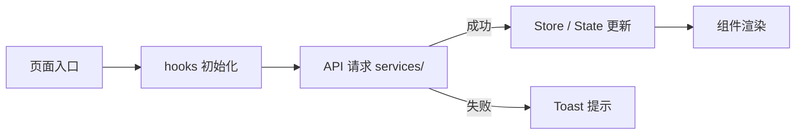

| **页面名称**：     | {页面名称}                    |
| ------------------ | ----------------------------- |
| **所属模块**：     | {父级模块}                    |
| **文档状态**：     | {生效中/待更新}               |
| **最后更新 commit**： |                             |

# 1. 页面概览

| 属性 | 内容 |
|------|------|
| 路由 | `/{path}` |
| 目标用户 | {角色} |
| 一句话职责 | {这个页面做什么} |

# 2. 架构设计

> **填写说明：** 记录页面级架构（目录结构、数据流）。简单页面可省略，但目录结构建议保留。没有可删除本章节。

## 目录结构

> 仅列出本页面相关目录，不列全量项目结构。

```
src/pages/{page-name}/
├── index.tsx               # 页面入口
├── types.ts                # 页面级类型
├── consts.ts               # 页面级常量
├── components/
│   ├── {ComponentA}/       # {职责说明}
│   └── {ComponentB}/       # {职责说明}
└── hooks/
    └── use{Xxx}.ts         # {职责说明}
```

## 数据流

> 可选。记录页面数据加载 / 操作的数据流向，复杂页面用 Mermaid 绘制。



# 3. 状态流转

> **填写说明：** 记录页面的关键状态及切换条件。用 Mermaid 或文字箭头链表示。

```
{状态A} ──{触发条件}──→ {状态B} ──{触发条件}──→ {状态C}
```

| 状态 | 触发条件 | UI 表现 |
|------|---------|---------|
| {加载中} | 进入页面 / 刷新 | Skeleton / Spin |
| {空数据} | 列表返回空 | 空态插画 + 引导文案 |
| {正常展示} | 数据加载成功 | 列表/表格/卡片 |
| {错误} | 接口异常 | Toast 提示 + 重试按钮 |

# 4. 核心组件

> **填写说明：** 只列页面级关键组件，不列通用原子组件（Button/Input 等）。

| 组件 | 文件路径 | 职责 | 关键 Props/Events |
|------|---------|------|-------------------|
| {SearchBar} | `./components/SearchBar/` | 搜索 + 筛选 | `onSearch(keyword)`, `onFilter(status)` |
| {DataTable} | `./components/DataTable/` | 列表渲染 + 分页 + 操作栏 | `data`, `onPageChange`, `onEdit`, `onDelete` |
| {FormModal} | `./components/FormModal/` | 新增/编辑弹窗 | `visible`, `initialValues`, `onSubmit` |

# 5. 关键业务规则

> **填写说明：** 状态枚举、权限控制、数据映射等"看一眼代码不容易发现"的规则。

### 状态枚举

| 枚举/常量 | 位置 | 值 → 含义 |
|-----------|------|-----------|
| {Status} | `src/constants/…` | `1` 启用, `0` 禁用 |

### 权限控制

| 操作 | 权限标识 | 无权限时表现 |
|------|---------|-------------|
| {新增} | `{module}:create` | 隐藏按钮 |
| {删除} | `{module}:delete` | 禁用按钮 + tooltip |

### 其他规则

- {规则说明}
