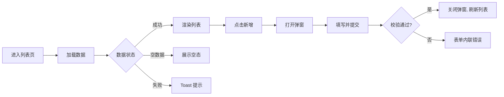

| **页面名称**：     | {页面名称}                    |
| ------------------ | ----------------------------- |
| **所属模块**：     | {父级模块}                    |
| **文档状态**：     | {生效中/待更新}               |
| **最后更新 commit**： |                             |

# 1. 页面概览

| 属性 | 内容 |
|------|------|
| 路由 | `/{path}` |
| 目标用户 | {角色} |
| 一句话职责 | {这个页面做什么} |

# 2. 目录结构

> 从 `src/` 开始，列出页面及关联的公共目录，帮助定位页面在项目中的位置。

```
src/
├── pages/{page-name}/
│   ├── index.tsx               # 页面入口
│   ├── types.ts                # 页面级类型
│   ├── consts.ts               # 页面级常量
│   ├── components/
│   │   ├── {ComponentA}/       # {职责说明}
│   │   └── {ComponentB}/       # {职责说明}
│   └── hooks/
│       └── use{Xxx}.ts         # {职责说明}
│
├── services/                   # 本页面依赖的接口（可选）
│   ├── XxxService/
│   │   ├── index.ts
│   │   └── types.ts
│   └── YyyService/
│       └── index.ts
│
├── constants/                  # 本页面用到的公共常量（可选）
│   └── status.ts
│
├── enums/                      # 本页面用到的公共枚举（可选）
│   └── event.ts
│
└── components/                 # 本页面用到的公共组件（可选）
    └── {公共组件名}/
        ├── index.tsx
        └── types.ts
```

# 3. 页面流程

> **填写说明：** 按"用户操作 → 系统响应 → 数据变更 → UI 更新"的时间序描述完整链路。数据流和业务状态机融合在流程中体现，不单独成节。简单页面用流程表即可，复杂页面加 Mermaid 图。

### 流程图



### 状态机

> 描述业务数据的**状态流转**，与流程流程表的状态变更列对应。仅在流程表无法覆盖完整状态机时单独绘制。


### 流程表

| 步骤 | 用户操作 | 系统响应 | 数据流 | 状态变更 | UI 更新 |
|------|---------|---------|--------|---------|--------|
| 1 | 进入页面 | 调用列表接口 | 请求参数 `{page, pageSize}`<br>响应 → store 更新 | loading → loaded | 展示列表 |
| 2 | 填写并提交 | 调用创建接口 | 请求体 `{name, ...}`<br>响应 → store 追加 | 草稿→待审核 | 关闭弹窗，刷新列表 |
| 3 | 点击行"删除" | 二次确认后调用删除接口 | 响应 `{success}` → store 移除 | 数据已删除 | 列表移除该项 |

### UI 渲染状态（可选）

> 仅当页面有特殊加载态/空态/错误态处理时记录，通用的 Skeleton/Toast 可省略。
>
> **判断标准：** 以下情况必写 → 1) 自定义空态插画/引导文案 2) 错误后有重试/降级/特殊兜底 3) 分步/异步加载。全为 antd-mobile 默认行为或全局统一封装时可跳过。

| 状态 | 触发条件 | UI 表现 |
|------|---------|---------|
| {加载中} | 进入页面 / 刷新 | Skeleton / Spin |
| {空数据} | 列表返回空 | 空态插画 + 引导文案 |
| {正常展示} | 数据加载成功 | 列表/表格/卡片 |
| {错误} | 接口异常 | Toast 提示 + 重试按钮 |

# 4. 核心组件

> **填写说明：** 只列页面级关键组件，不列通用原子组件（Button/Input 等）。

| 组件 | 文件路径 | 职责 | 关键 Props/Events |
|------|---------|------|-------------------|
| {SearchBar} | `./components/SearchBar/` | 搜索 + 筛选 | `onSearch(keyword)`, `onFilter(status)` |
| {DataTable} | `./components/DataTable/` | 列表渲染 + 分页 + 操作栏 | `data`, `onPageChange`, `onEdit`, `onDelete` |
| {FormModal} | `./components/FormModal/` | 新增/编辑弹窗 | `visible`, `initialValues`, `onSubmit` |

# 5. 关键业务规则

> **填写说明：** 状态枚举、权限控制、数据映射等"看一眼代码不容易发现"的规则。

### 状态枚举

| 枚举/常量 | 位置 | 值 → 含义 |
|-----------|------|-----------|
| {Status} | `src/constants/…` | `1` 启用, `0` 禁用 |

### 权限控制

| 操作 | 权限标识 | 无权限时表现 |
|------|---------|-------------|
| {新增} | `{module}:create` | 隐藏按钮 |
| {删除} | `{module}:delete` | 禁用按钮 + tooltip |

### 其他规则

- {规则说明}
